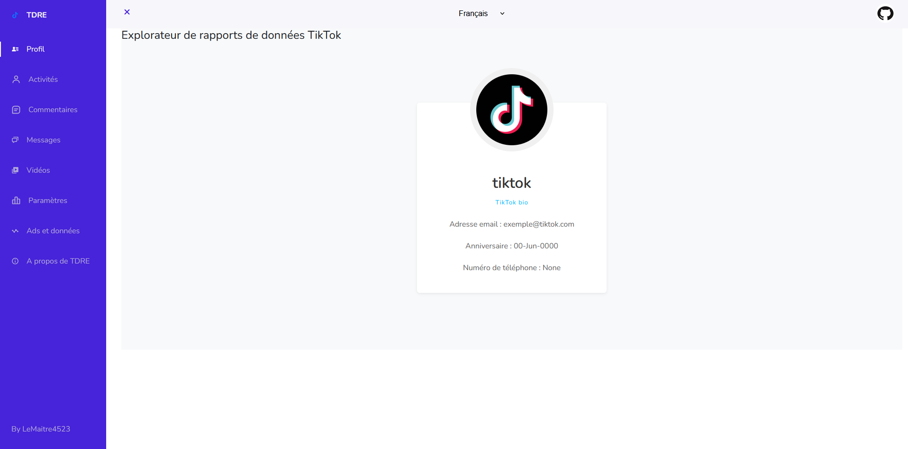
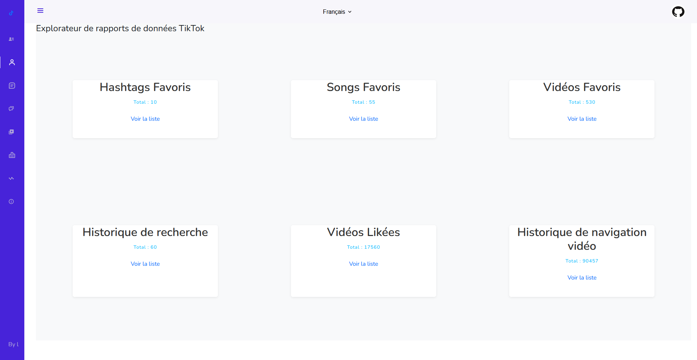

# TikTok Data Report Explorer - TDRE

Une manière plus simple d'explorer vos données TikTok !
Glissez-déposez votre fichier et laissez TDRE s'en occuper.

An easier way to explore your TikTok data!
Drag and drop your file and let TDRE take care of it.


## Authors

- [@LeMaitre4523](https://www.github.com/lemaitre4523)


## License

[](https://github.com/LeMaitre4523/tiktok-data-report-explorer/blob/main/LICENSE)


## Demo






## Usage

Glissez-déposez simplement votre fichier .JSON et laissez faire TDRE.

Simply drag and drop your .JSON file and leave it to TDRE.
## Question

Où demander mon rapport de données ?

```text
Paramètres et confidentialité > Confidentialité > Télécharger tes données > Séléctionnez JSON > Télécharger tes données
```
Puis vous devrez patienter quelques jours


Where can I request my data report ?
```text
Settings and privacy > Privacy > Download your data > Select JSON > Download your data
```
Then you will have to wait a few days 

## Fonctionnalités
- [x] Informations du profil

- [x] Activités
  - [x] Total du nombre de likes/favoris(hashtags, sons...)
  - [ ] Liste des vidéos likées/son, hashtags, vidéos...

- [x] Commentaires

- [x] Vidéos

- [ ] Messages (si dispo par tiktok)

- [ ] Paramètres

- [ ] ADS

## Dépendances
Popup Message by Sweetalert

Navbar by BBBootstrap
